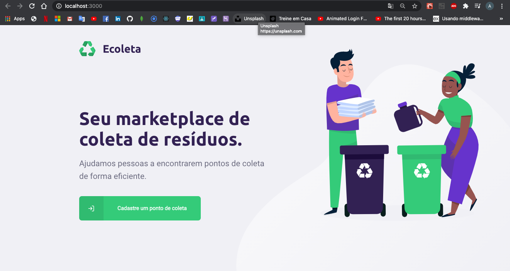
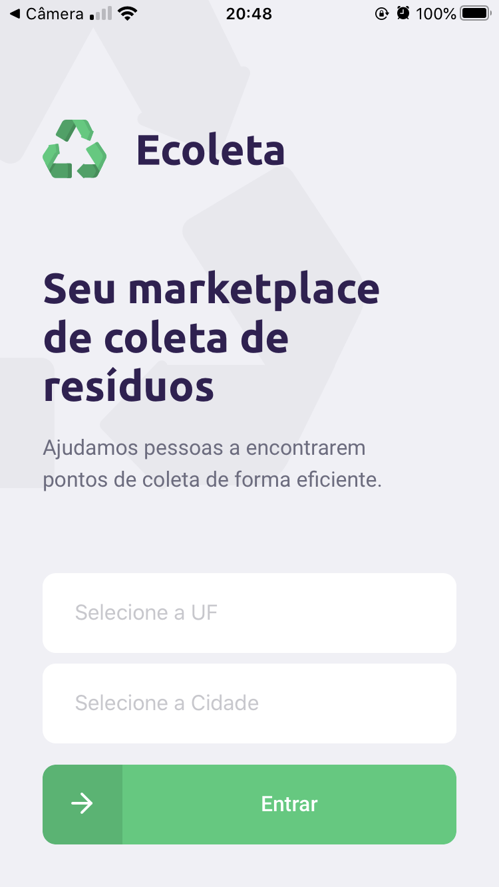
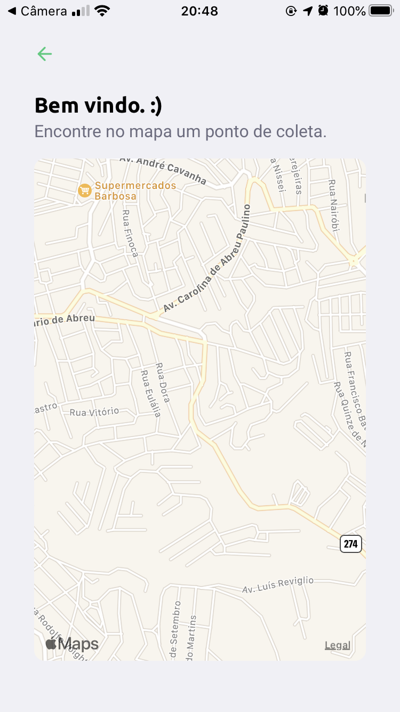

<h3 align="center">
    
</h3>

<p align="center">
  <a href="https://rocketseat.com.br">
    
  </a>
  <a>
</p>

# Índice

- [Sobre](#sobre)
- [Tecnologias Utilizadas](#tecnologias-utilizadas)
- [Como Usar](#como-usar)

<a id="sobre"></a>

## :bookmark: Sobre

O <strong>Ecoleta</strong> é uma aplicação Web e Mobile para com o foco em ajudar as pessoas a encontrarem pontos de coleta para reciclagem de resíduos específicos. 
<br />
**Exemplo:** Óleo de cozinha, pilhas e baterias.

Essa aplicação foi desenvolvida durante a <strong>Next Level Week</strong> organizada e realizada  pela [Rocketseat](https://rocketseat.com.br/).

<a id="tecnologias-utilizadas"></a>

## :rocket: Tecnologias Utilizadas

Durante o desenvolvimento desse projeto utilizamos as seguintes tecnologias.

- TypeScript
- Node.js
- ReactJS
- React Native

## :computer: Web

Abaixo está um exemplo da home da aplicação web

<h1 align="center">
    
</h1>

## :iphone: Mobile

Abaixo está um exemplo da home e página onde é localizado os pontos de coleta da aplicação mobile

<h1 align="center">
    
    
</h1>

<a id="como-usar"></a>

## :question: Como usar

- #### Para conseguir rodar a aplicação é necessário alguns **pré-requisitos:**

  - É **necessário** possuir o **Node.js** instalado na máquina
  - Também, é **preciso** ter um gerenciador de pacotes seja o **NPM** ou **Yarn**.
  - E por último mas não menos importante, é **essencial** ter o **Expo** instalado de forma global na máquina

1. Faça um clone :

```sh
  $ git clone https://github.com/Arthurferrera/ecoleta.git
```

2. Para executar a Aplicação execute os seguintes comandos:

```sh
  # Primeiro instale as dependências
  $ npm install

  ## Crie o banco de dados
  $ cd server
  $ npm run knex:migrate
  $ npm run knex:seed

  # Inicie a API
  $ npm run dev

  # Inicie a aplicação web
  $ cd web
  $ npm start

  # Inicie a aplicação mobile
  $ cd mobile
  $ npm start
```

<h5 align="center">
    Developed by <a href="https://www.linkedin.com/in/arthurferreira99/" target="_blank">Arthur Ferreira</a>
</h5>
